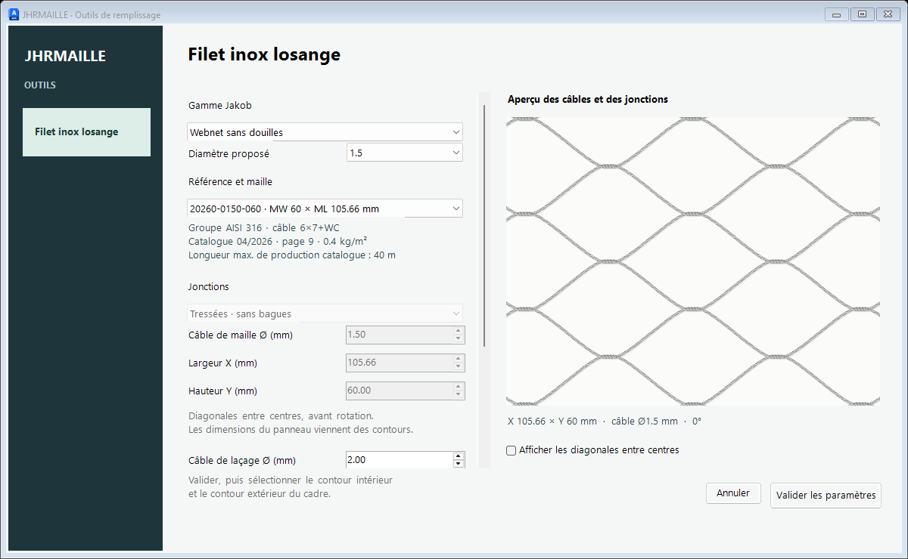

# JHRMAILLE 1.2 — maille inox détaillée en 2D

Commande AutoLISP pour créer un remplissage de câbles en losanges et son laçage autour d’un cadre. L’interface propose un aperçu des torons, les jonctions avec bagues ou tressées sans douilles et les références losangées du catalogue Jakob Webnet.

## Installation

Télécharger le dossier complet **JHRMaille2D** du dépôt, ou l’archive du dépôt : le LISP seul ne contient pas l’interface. Les deux fichiers nécessaires sont `JHR_Maille_2D.lsp` et `JhrMailleUi_v1_2.dll`.

1. Dans AutoCAD pour Windows, charger `JHR_Maille_2D.lsp` avec **APPLOAD**.
2. Charger `JhrMailleUi_v1_2.dll` avec **NETLOAD**. Cette étape n’est pas nécessaire si le dossier est déjà dans les chemins de recherche et que le LISP trouve la DLL automatiquement.
3. Respecter les règles de sécurité de l’installation. L’outil ne modifie pas SECURELOAD ou TRUSTEDPATHS.
4. Lancer **JHRMAILLEPARAM** pour vérifier que la fenêtre s’ouvre, puis **JHRMAILLE** pour créer un panneau.

La DLL est compilée et testée pour **AutoCAD / Advance Steel 2027, Windows 64 bits, .NET 10**. Sur une autre version, utiliser **JHRMAILLECLI** et **JHRMAILLEPARAMCLI**, ou recompiler l’interface avec le SDK correspondant. La compatibilité ARES, Mac et autres moteurs LISP n’est pas validée.

## Navigation entre les outils

La colonne à gauche regroupe les outils de **JHRMAILLE**. Le premier outil s’appelle **Filet inox losange** et est sélectionné à l’ouverture. Ses paramètres restent au centre et son aperçu à droite. Cliquer sur l’outil sélectionné conserve les valeurs et laisse la fenêtre ouverte. La colonne est prévue pour accueillir les futurs outils ; cette version ne propose que Filet inox losange.

## Dessiner un panneau

1. Travailler en **millimètres à 1:1**, dans l’espace objet.
2. Préparer deux polylignes 2D **LWPOLYLINE fermées**, coplanaires : le contour intérieur du cadre et son contour extérieur. Le second doit entourer strictement le premier, sans croisement ni contact.
3. Choisir le calque du panneau, puis lancer **JHRMAILLE**.
4. Choisir la gamme, le diamètre proposé et la référence. Ou sélectionner **Personnalisée · saisie libre** pour régler librement la maille.
5. Régler séparément le diamètre de laçage, le retrait, l’orientation et les raccords d’angle. L’aperçu se met à jour immédiatement.
6. Cliquer sur **Valider les paramètres**, puis sélectionner le contour **intérieur**, suivi du contour **extérieur**.

Le résultat est un bloc statique nommé `JHR_MAILLE_2D_…`, placé sur le calque courant. Tout son contenu est sur le **calque 0, couleur et épaisseur DuCalque**. Les deux contours sources sont conservés. L’opération est groupée pour une annulation AutoCAD en une étape lorsque ANNULER est activé.

**Annuler, Échap et la croix** ferment la fenêtre sans modifier les réglages ni créer d’objet. JHRMAILLEPARAM ouvre la même fenêtre et mémorise uniquement les réglages de la session. Le rechargement du LISP ne transforme pas les panneaux déjà créés : régénérer un remplissage à partir des contours conservés.

## Choix Jakob : 202 références

Valeurs reprises du [catalogue fabricant Webnet, édition 04/2026](https://www.jakob.com/files/6_downloads/catalogues/Jakob-Rope-Systems-catalogue-webnet.pdf), consulté le 10 octobre 2026.

| Gamme proposée | Références |
|---|---:|
| Webnet Micro | 36 |
| Webnet standard avec douilles | 14 |
| Webnet sans douilles | 62 |
| Webnet Duplex avec douilles | 41 |
| Webnet Duplex sans douilles | 41 |
| Webnet Micro en rouleau | 8 |

Seuls les diamètres et tailles réellement listés dans chaque gamme sont proposés. Le choix renseigne le diamètre de câble, **ML sur X**, **MW sur Y**, le mode de jonction et les dimensions b3/b4 des douilles lorsqu’elles existent. Ces valeurs sont des diagonales **entre centres, avant rotation**, pas l’ouverture libre entre câbles ni les dimensions du panneau.

La grande diagonale reprend la valeur exacte du tableau : elle n’est pas recalculée depuis la petite. Les dimensions **H × L** d’une référence en rouleau décrivent le rouleau ; la maille utilise sa référence Micro de base. La famille, la matière indiquée au catalogue, le poids et la longueur maximale de production s’affichent sous le choix. Cette longueur de production ne fixe pas la longueur admissible de panneaux d’un chantier.

Pour conserver l’identification fabricant, les dimensions et le type de jonction sont verrouillés tant qu’une référence est sélectionnée. **Personnalisée · saisie libre** conserve ses valeurs et permet de les modifier, puis retire l’identification fabricant. Les réglages de laçage, retrait, orientation et butées restent indépendants. L’ancien réglage libre **104 × 60 mm** n’est pas remplacé automatiquement par une référence du catalogue.

La référence, la gamme et la matière du catalogue sont enregistrées dans les données étendues `JHR_WEBNET` du bloc créé. Une modification des dimensions par la commande CLI invalide l’identification avant la génération suivante. Le catalogue est embarqué : aucune connexion réseau n’est requise à l’ouverture.

Voir [les sources et la correspondance des colonnes](Interface/Catalogue_Jakob_SOURCES.md) et [les données JSON](Interface/JakobWebnet.json). Les motifs Evo et les plaquettes ID ne font pas partie des mailles losangées demandées.

## Fonctionnement du dessin

Le moteur calcule un retrait vers l’intérieur du cadre et implante des losanges complets. Sur un rectangle, il recherche la plus grande grille complète qui tient, puis la centre. Le **retrait réglé à 20 mm reste un minimum strict** : il peut augmenter pour terminer la maille avec des losanges complets. Il n’est pas réduit pour ajouter une rangée.

Les profils inclinés et trapézoïdaux sont pris en compte. Les retours de laçage mesurent la largeur locale entre les deux contours, ce qui adapte leurs courbes à chaque profil. Les rives latérales comportent des œillets sertis ; les traverses haute et basse des boucles de maille. Chaque attache reçoit un brin passant devant et un brin derrière le cadre. Les parties arrière sont masquées dans cette représentation en élévation. Les retours latéraux touchent la face extérieure du profil, sans jeu artificiel.

La case **Compléter les angles automatiquement** ajoute un brin terminé par un œillet lorsqu’un angle incomplet laisse la place à ce brin, et adoucit la transition entre les côtés et les traverses. Elle ne coupe pas les losanges existants. Décocher conserve le raccord classique.

Les composants de jonction sont des blocs réutilisés. Le mode sans douilles dessine une jonction tressée par diamètre ; il ne dessine pas de bague de maille. L’aperçu est une illustration procédurale des câbles et des jonctions, pas une photographie fabricant ni une simulation du cadre entier.

Les boucles, œillets et accessoires de laçage restent des représentations graphiques génériques ; le choix d’une référence de filet ne sélectionne pas automatiquement une finition de rive ni un système de fixation complet. Leurs contours ne sont pas des gabarits d’usinage ou de sertissage.

Les contours ouverts, croisés ou incompatibles, les retraits impossibles et les panneaux trop petits sont refusés. Une limite de **15 000 nœuds** évite les calculs excessifs : diviser les très grands panneaux. Contrôler le résultat dans les angles aigus et les contours concaves ; les segments courbes sont échantillonnés.

## Sources et vérification

Le moteur se trouve dans `JHR_Maille_2D.lsp`. Le dossier **Interface** contient les sources C#, le catalogue embarqué et les tests. L’interface renvoie les paramètres au LISP et ne modifie pas le DWG elle-même.

Compilation : `dotnet build Interface/JhrMailleUi.csproj -c Release`, avec le SDK .NET 10 et AutoCAD 2027 installé. Le chemin des références AutoCAD peut être fourni par la propriété `AutoCAD`. La DLL produite est dans `Interface/dist/`.

Tests de l’interface : `dotnet run --project Interface/Tests/Tests.csproj -c Release -- CHEMIN_ABSOLU_DES_IMAGES`, sous Windows. Les images et résultats générés servent au contrôle ; ils ne sont pas ajoutés au dépôt.

Validation du 10 octobre 2026 : compilation sans avertissement ; les 202 références appliquées et filtrées dans l’interface ; maintien des réglages de montage ; saisie libre et restauration du choix ; essais natifs AutoCAD de validation, Annuler, croix et Échap ; génération de panneaux standard sans douilles et Micro avec douilles ; référence conservée dans le bloc et invalidée après changement de dimensions. Les fonctions de géométrie restent celles de la version de rives validée précédemment. Les dessins de travail ouverts ont conservé leurs nombres d’objets et leurs états de sauvegarde pendant ces essais.
